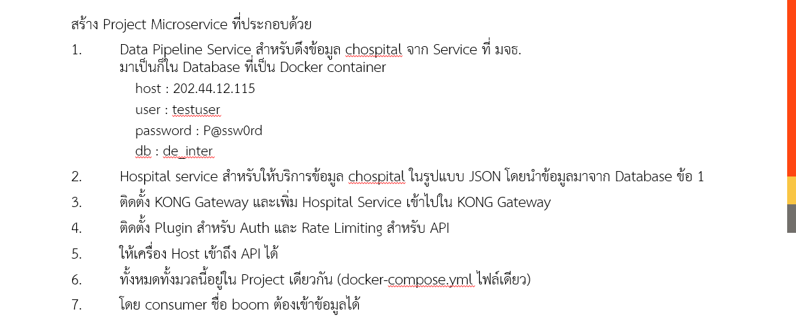

# geeks2-api-gateway
GEEKS 2 : API Gateway

## Lab 0 : docker image pull
```sh
sudo docker image pull postgres:13
sudo docker image pull kong:3.7.0
```
## Lab 1 : ติดตั้ง KONG
สร้าง folder ใหม่ ชื่อ kong
```
mkdir kong
cd kong
```
สร้างไฟล์ docker-compose.yml ด้วยเนื้อหาดังนี้
```yml
version: '3'
volumes:
  kong_data: {}
networks:
  kong-net:
    external: false
services:
  kong-database:
    image: postgres:13
    container_name: kong-database
    networks:
      - kong-net
    ports:
      - 5432:5432
    environment:
      POSTGRES_USER: kong
      POSTGRES_DB: kong
      POSTGRES_PASSWORD: kongpass
    volumes:
      - kong_data:/var/lib/postgresql/data
  kong-migrations:
    image: kong:3.7.0
    command: kong migrations bootstrap
    environment:
      KONG_DATABASE: postgres
      KONG_PG_HOST: kong-database
      KONG_PG_PASSWORD: kongpass
    depends_on:
      - kong-database
    networks:
      - kong-net
  kong:
    image: kong:3.7.0
    networks:
      - kong-net
    environment:
      KONG_DATABASE: postgres
      KONG_PG_HOST: kong-database
      KONG_PG_USER: kong
      KONG_PG_PASSWORD: kongpass
      KONG_PROXY_ACCESS_LOG: /dev/stdout
      KONG_ADMIN_ACCESS_LOG: /dev/stdout
      KONG_PROXY_ERROR_LOG: /dev/stderr
      KONG_ADMIN_ERROR_LOG: /dev/stderr
      KONG_ADMIN_LISTEN: 0.0.0.0:8001, 0.0.0.0:8444 ssl
      KONG_ADMIN_GUI_URL: http://localhost:8002
    ports:
      - 8000:8000
      - 8443:8443
      - 127.0.0.1:8001:8001
      - 127.0.0.1:8002:8002
      - 127.0.0.1:8444:8444
```
ใช้คำสั่ง
```sh
sudo docker-compose up -d
```
ถ้าการติดตั้งสมบูรณ์จะสามารถเข้าดู KONG manager ได้ผ่าน Web browser ที่
```
http://localhost:8002
```

## งานสรุป Data Pipeline and API


เฉลยอยู่ [ตรงนี้](final.zip) นะครับ ^__^
